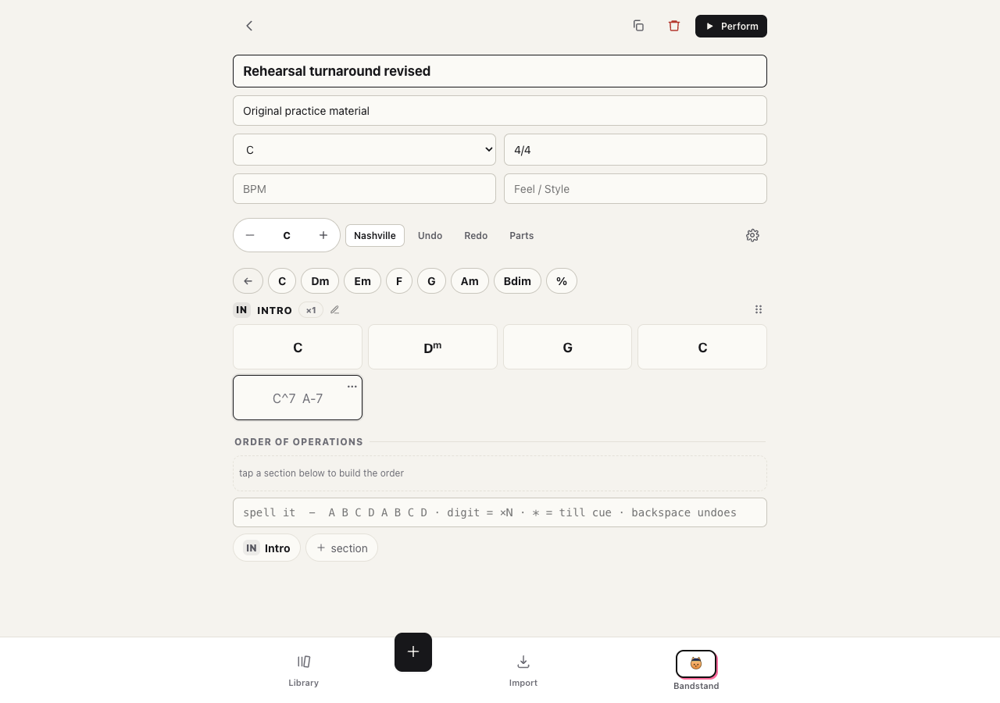
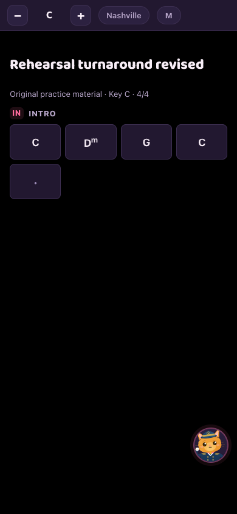

# Make a chart, share the book

SaltyCharts ships inside Bandstand. One install serves the reader at `/app/` and
the editor at `/charts/`.

1. Start Bandstand using the self-hosting guide. Sign into the reader as the
   director, then open **Repertoire, New chart**.
2. Choose **New chart** in the editor. Enter a title, tap the first bar, and write
   your chords. The palette advances through empty bars as you enter them.
3. Give each band member their own sign-in from Bandstand. Members open
   **Repertoire** in the reader and select the chart.
4. Edit the chart as the director. Connected members receive the updated chart
   in the same book without refreshing. Members can read it and keep their own
   notes; they cannot edit the band's source chart.

The editor reuses the director's sign-in when opened from the reader on the same
server. An editor on another device or server needs explicit pairing. Signing out
of the reader clears the inherited editor connection and keeps the local charts.

These screenshots show an original four-bar practice exercise on a fresh local
test server. They contain no real band library, member details or copyrighted
song arrangements.

For an offline gig, first cache the book using a secure HTTPS address and verify
it on the devices you will use. These screenshots demonstrate connected syncing;
they do not establish readiness on every phone or offline browser.
